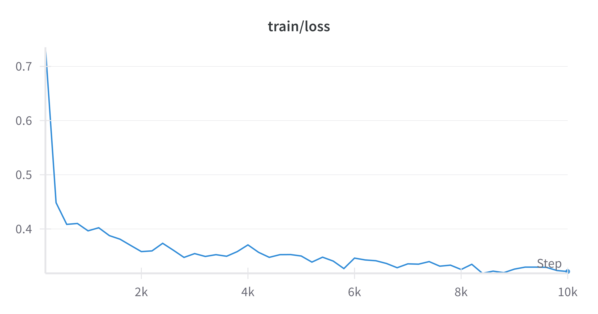

Here is my work for Part B.

0. On mac, run export MUJOCO_GL=glfw 
1. Task & Dataset 

Visualise dataset with
python -m lerobot.scripts.visualize_dataset     --repo-id lerobot/xarm_lift_medium     --episode-index 0

I will be using the xarm-lift-medium dataset from https://huggingface.co/datasets/lerobot/xarm_lift_medium, 
since it uses a simulated environment (required for eval) and has not been used in 
the provided pretrained models.The task for the arm is to simply pick up the cube and raise
it above a certain height by controlling 4 paramters: [x, y, z] for the position of the 
end effector and [w] for the gripper. The observation space is the 4D vector representing the agent's state 
and an 84 x 84 image. When I used the dataset visualisation tool, I found that, 
surprisingly, the robot attained a low reward and failed the task in every episode that I checked
(see the recording [Watch demo](dataset_viz.mp4)). In practice, having some failure cases in the dataset can help
mitigate the distributional shift problem by essentially showing the policy how to correct
its mistakes, but in this case I did not find a single successful trajectory. This means that performing imitation learning alone on this dataset 
will not learn the task. However, since learning the task is not the focus of this exercise, I will proceed
with this dataset anyway.

2. Train a diffusion policy from scratch using scripts.train
python -m lerobot.scripts.train \
    --policy.type=diffusion \
    --env.type=xarm \
    --dataset.repo_id=lerobot/xarm_lift_medium \
    --wandb.enable=true \
    --policy.device=mps \
    --policy.push_to_hub=false \
    --eval_freq=1000 \
    --steps=10000 \
    --output_dir=part_b/outputs/train/xarm

For this part I trained the diffusion policy for 10 000 steps (much fewer than
the default 100 000) with evals every 2000 steps. 

The negative reward indicates that the policy has failed to learn the task, 
which is expected given
the expert demonstrations in the dataset also fail the task. 

The decrease in train loss shows that the policy is at least able to fit the dataset.
In a successful imitation learning run, we would expect the eval rewards to 
increase while the training loss decreases.

Although the eval loss is not tracked, I think it makes sense to also
track eval loss  (by splitting the dataset into
train/eval as we would do
in traditional supervised learning, which imitation learning essentially is). 
This way, we can make sure that the policy is not overfitting and we can 
distinguish between two cases if the model is not performing well in the environment: 1) If 
the model performs poorly but it has fit the 
dataset well with low eval loss, then the issue is not with the model itself
but possibly the expert demonstrations or environment 2) If the model performs poorly 
and we see that it has overfitted the dataset
with high eval loss, then we know this needs to be addressed first.

Let's also see the policy run near the start and end of training, from the W&B 
logs:
[Start of training](start_eval.mp4) and
[End of training](end_eval.mp4).
Near the start, the arm does not even get close to the cube, and at the end 
it manages to nudge the cube a bit. So it has learnt _something_, but is still 
nowhere close to solving the task.

3. Evaluate the policy

python -m lerobot.scripts.eval \
    --policy.path=part_b/outputs/train/xarm/checkpoints/000010/pretrained_model \
    --env.type=xarm \
    --eval.batch_size=1 \
    --eval.n_episodes=1 \
    --policy.use_amp=false \
    --policy.device=mps \
    --output_dir=part_b/outputs/eval/xarm

Finally, here is a recording of me running the eval video generated by the eval script. \
[Eval](eval.mp4)

Here, the arm appears to be trying to raise the cube, but it did so before 
actually grasping the cube. 